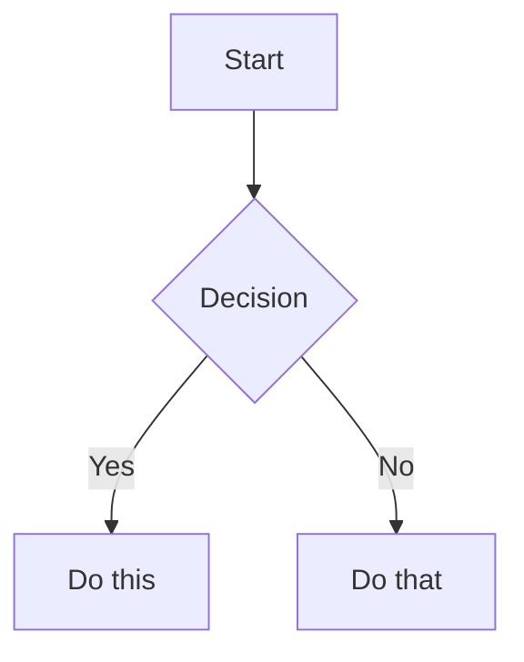

# Obsidian Flavored Markdown Reference

## Internal Links (Wikilinks)

```
[[Note Name]]                  link to note
[[Note Name|Display Text]]     custom display text
[[Note Name#Heading]]          link to heading
[[Note Name#^block-id]]        link to block
[[#Heading in same note]]      same-note heading link
```

Block IDs: append `^block-id` after any paragraph. For lists/quotes, place on a separate line after the block.

Always use `[[wikilinks]]` for vault-internal notes (Obsidian tracks renames). Use `[text](url)` for external URLs only.

## Embeds

Prefix any wikilink with `!` to embed inline:

```
![[Note Name]]                 embed full note
![[Note Name#Heading]]         embed section
![[image.png]]                 embed image
![[image.png|300]]             embed image with width
![[document.pdf#page=3]]       embed PDF page
```

## Callouts

```
> [!note]
> Basic callout.

> [!warning] Custom Title
> Callout with custom title.

> [!faq]- Collapsed by default
> Foldable (- = collapsed, + = expanded).
```

Common types: `note` `tip` `warning` `info` `example` `quote` `bug` `danger` `success` `failure` `question` `abstract` `todo`

## Properties (Frontmatter)

```yaml
---
title: My Note
date: 2024-01-15
tags:
  - project
  - active
aliases:
  - Alternative Name
cssclasses:
  - custom-class
---
```

Standard properties: `tags`, `aliases`, `cssclasses`. Any additional key becomes a custom property.

## Tags

```
#tag                inline tag
#nested/tag         nested tag with hierarchy
```

Tags can contain letters, numbers (not first char), underscores, hyphens, forward slashes. Also definable in frontmatter under `tags`.

## Obsidian-Specific Formatting

```
==Highlighted text==    highlight
%%hidden comment%%      hidden in reading view (inline or block)
```

## Math (LaTeX)

```
Inline: $e^{i\pi} + 1 = 0$

Block:
$$
\frac{a}{b} = c
$$
```

## Diagrams (Mermaid)

````

````

To link Mermaid nodes to vault notes: `class NodeName internal-link;`

## Footnotes

```
Text with footnote[^1].
[^1]: Footnote content.

Inline footnote^[This is inline.]
```
